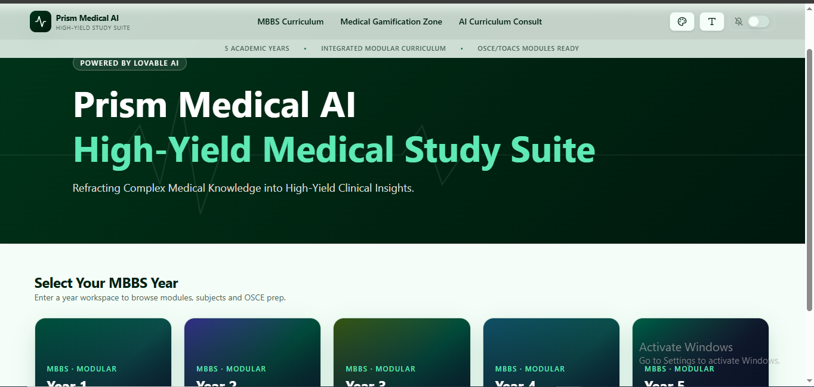
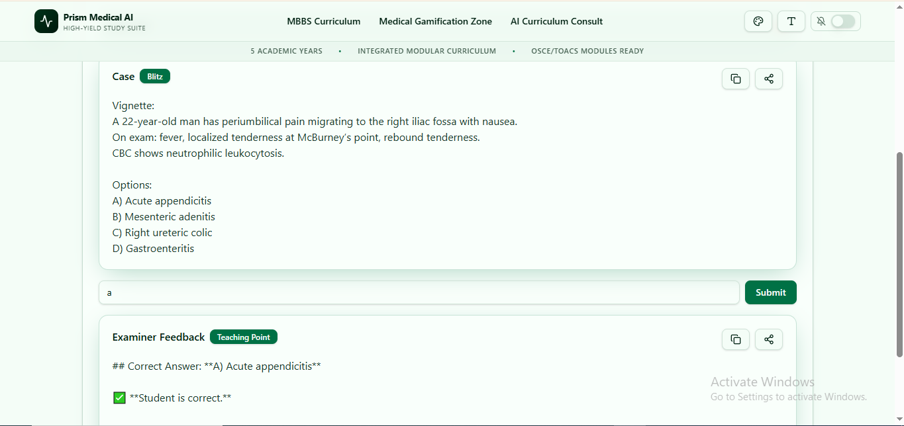

# Prism Medical AI — High-Yield Medical Study Suite

> **Live Application URL:** https://prism-med-study.lovable.app/  
> **GitHub Repository:** https://github.com/Winter-0310/prism-medical-ai-suite

---

## 📌 Executive Summary & Project Overview

**Prism Medical AI** is a complete, high-yield medical education web application custom-engineered for undergraduate **MBBS students** across all 5 years of the Integrated Modular Curriculum. Designed under the motto *"Refracting Complex Medical Knowledge into High-Yield Clinical Insights"*, Prism Medical AI synthesizes dense basic medical sciences, clinical specialities, TOACS/OSCE stations, and diagnostic decision frameworks into intuitive, interactive study tools.

The application is published directly through Lovable, making it instantly accessible on the web across all devices without requiring sign-ins, local server installations, or external software.

---

## 📸 Application Visuals & Live Demo

### 1. Main Dashboard & Hero Entry Screen

*Figure 1: Hero Entry Screen featuring dark-green ambient styling, font size scalers, Do Not Disturb toggle, quick stats, and the 5-Year MBBS selection grid.*

### 2. Active Clinical Study Module & AI Consult

*Figure 2: Active clinical workspace displaying high-yield modular notes, TOACS step-by-step guidance, and interactive study games.*

---

## ✨ Comprehensive Feature Matrix

### 1. Built-in AI Integration (Zero API Configuration)
* **Out-of-the-Box Functionality:** Powered by Lovable's built-in AI connector, allowing the app to operate seamlessly for any user without requiring an API key.
* **Server-Side Fallback Handling:** Features clean UI error handling ("AI response unavailable. Please retry.") to ensure uninterrupted study sessions.

### 2. Main App Landing Interface (Hero Entry Screen)
* **Hero Banner:** Ambient dark-green clinical gradient overlay displaying the tagline *"Refracting Complex Medical Knowledge into High-Yield Clinical Insights"*.
* **Top Accessibility Bar:** Includes App Logo, Theme Switcher, Font Size Scaler (**S / M / L**), and a **Do Not Disturb (DND)** workspace focus toggle.
* **Navigation Header:** Direct routing across *"MBBS Curriculum"*, *"Medical Gamification Zone"*, and *"AI Curriculum Consult"*.
* **Quick Stats Bar:** At-a-glance status covering 5 Academic Years, Integrated Modular Syllabus, and OSCE/TOACS Readiness.
* **MBBS Year Grid:** 5 dark-gradient cards with custom cover art:
  * **Year 1:** Basic Human Body / Molecular DNA.
  * **Year 2:** Organ Systems / Neuro-Anatomical Brain.
  * **Year 3:** Laboratory / Microscopic Microbiology.
  * **Year 4:** Specialized Diagnostics / Eye-ENT Sensory.
  * **Year 5:** Clinical Ward / Stethoscope & Bedside Hospital.

### 3. Dual Navigation & Mapped Curriculum Workspace
Every academic year workspace includes a TWO-toggle selection mode (**"Browse by Module"** vs. **"Browse by Subject"**) with 100% readable dark gradient contrast cards:
* **YEAR 1:** *Modules:* Foundation, MSK-1, Hematology & Immunity, CVS-1, Resp-1 | *Subjects:* Anatomy & Histology, Physiology, Biochemistry, Behavioral Sciences, Research & Ethics.
* **YEAR 2:** *Modules:* GIT-2, Renal & Excretory, Endocrine & Reproduction, CNS-1, Special Senses | *Subjects:* Gross & Neuroanatomy, Embryology & Histology, Medical Physiology, Medical Biochemistry.
* **YEAR 3:** *Modules:* General Pathology, Microbiology, General Pharmacology, Forensic Medicine, Community Medicine | *Subjects:* Pathology, Pharmacology, Forensic Medicine, Community Medicine, Clinical Foundation.
* **YEAR 4:** *Modules:* Special Pathology, Ophthalmology, ENT, MSK-2 & Dermatology, CNS-2 & Psychiatry | *Subjects:* Ophthalmology, ENT, Special Pathology, Community & Family Medicine, Orthopedics, Dermatology.
* **YEAR 5:** *Modules:* Medicine & Allied, Surgery & Allied, Paediatrics, Obs/Gynae | *Subjects:* General Medicine, General Surgery, Paediatrics, Obstetrics & Gynaecology, Clinical TOACS / OSCE Stations.

### 4. Medical Gamification Zone (Productive Revision)
Includes 3 interactive study mini-games designed to enhance clinical recall:
1. **Rapid-Fire Diagnosis Blitz:** 3-line clinical vignettes with 30-second decision timers for provisional diagnosis or next best step.
2. **Pharma-Match & Mechanism Challenge:** Interactive matching game pairing high-yield drugs with mechanisms of action (MOA) and adverse effects.
3. **OSCE Station Simulator:** Simulated history-taking and physical examination scenarios providing real-time structured feedback.

### 5. AI Curriculum & Clinical Consult
Dedicated search and chat workspace allowing students to:
* Verify whether a topic is **High-Yield for MBBS Exams**, **Low-Yield**, or **Out-of-Syllabus / Postgraduate Level**.
* Ask clinical ward queries restricted strictly to medical education parameters.

### 6. App Themes, UI Modes & ECG Pulse Animation
* **Color Themes:** *"Zen Green"* (Default Emerald/Sage), *"Dark Clinical"* (Charcoal Dark Mode), *"Light Medical"* (High-Contrast Teal/White), and *"Focus Mode"*.
* **Do Not Disturb Mode:** Hides non-essential badges for a distraction-free revision layout.
* **ECG Pulse Loading Indicator:** Animated P-QRS-T heartbeat wave displaying cycling status updates (*"Refracting Clinical Evidence..."*, *"Mapping High-Yield Points..."*, *"Formatting OSCE Checklists..."*).

### 7. Output Display & Study Tools
* Response cards equipped with **Copy to Clipboard**, **Share Controls**, and **High-Yield Tag Badges**.

---

## 🔒 Built-in Guardrails & System Instructions

The application enforces strict built-in operational parameters:
1. **Domain Restriction:** Rejects non-medical topics automatically to preserve focus on medical education.
2. **Patient Safety:** Directs any real-time emergency diagnosis prompts to real-world emergency services.
3. **Pedagogical Alignment:** Tailors complexity to the user's specific academic stage (Y1–Y2: Core Mechanisms; Y3–Y4: Diagnostic Criteria & OSPE; Y5: TOACS, SOAP Notes, Management Algorithms).

---

## 🚀 Deployment & Publishing Workflow

* **Application Design & Generation:** Built and configured entirely within **Lovable**.
* **Direct Web Publishing:** Published live directly through Lovable's hosting platform without third-party deployment tools or local software setup.
* **GitHub Repository Sync:** Source code connected and synced directly to GitHub (`Winter-0310/prism-medical-ai-suite`).

---

## 📜 Submission Details

* **Project Title:** Prism Medical AI — High-Yield Medical Study Suite
* **Live Web URL:** https://prism-med-study.lovable.app/
* **GitHub Repository:** https://github.com/Winter-0310/prism-medical-ai-suite
* **Access Status:** Publicly deployed on the web, fully operational across all browsers without requiring sign-in or login credentials.
